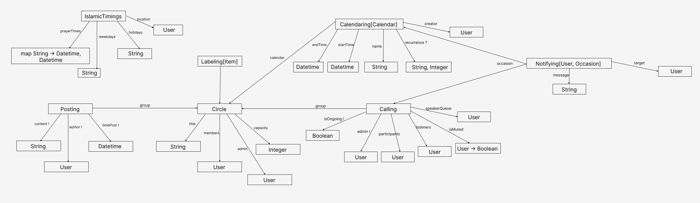
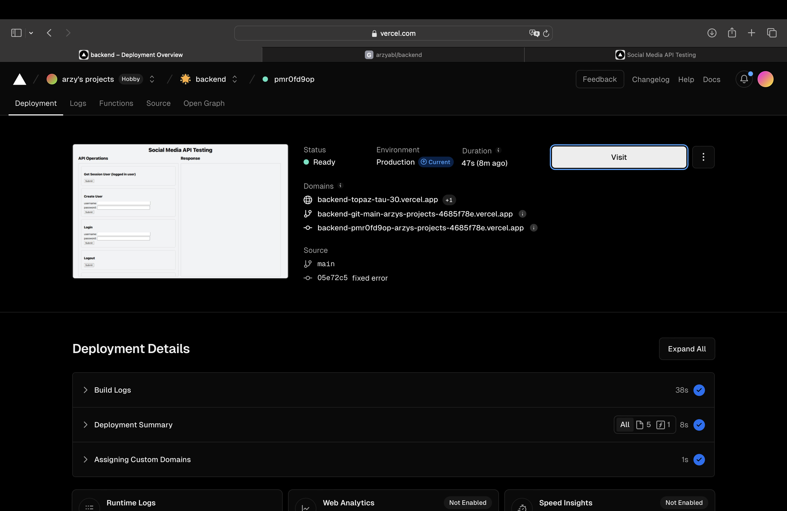

# Backend Design & Implementation - Alpha

## Data Model
I didn't modify my concepts since last assignment.

## Concept Implementation
I implemented two concetps - Calling and Circle. See code links below:
- [Calling Concept](https://github.com/arzyabl/backend/blob/main/server/concepts/calling.ts )
- [Circle Concept](https://github.com/arzyabl/backend/blob/main/server/concepts/circling.ts )

## RESTful routes outline
[See the code here](https://github.com/arzyabl/backend/blob/main/server/routes.ts)

## Deployement
I deployed my project in Vercel.
