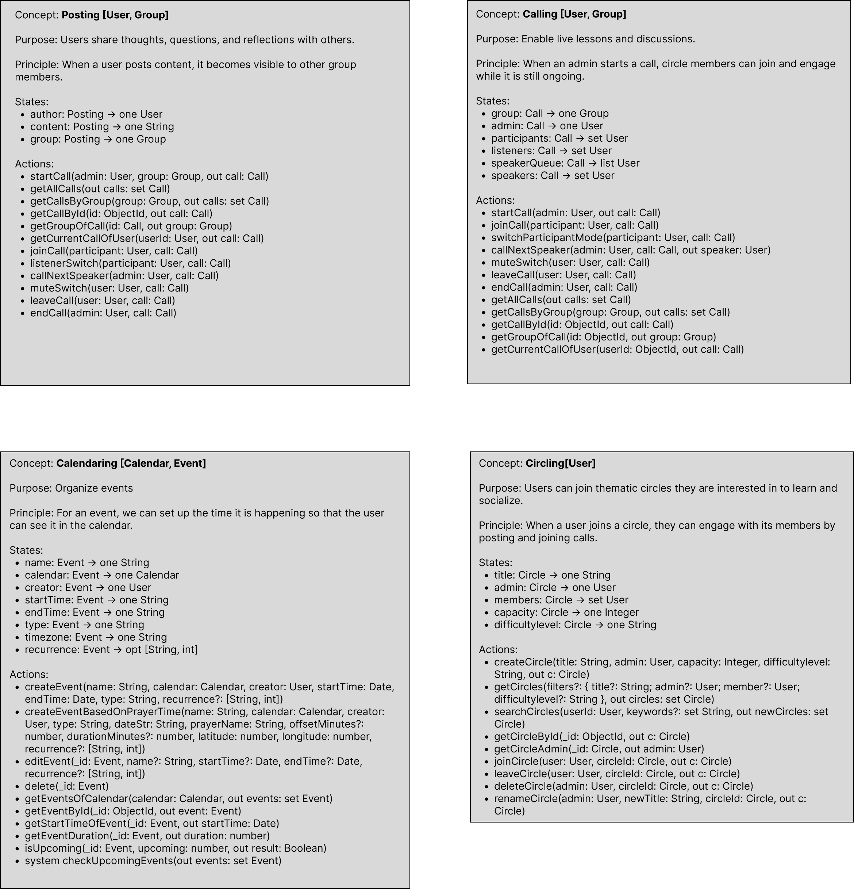
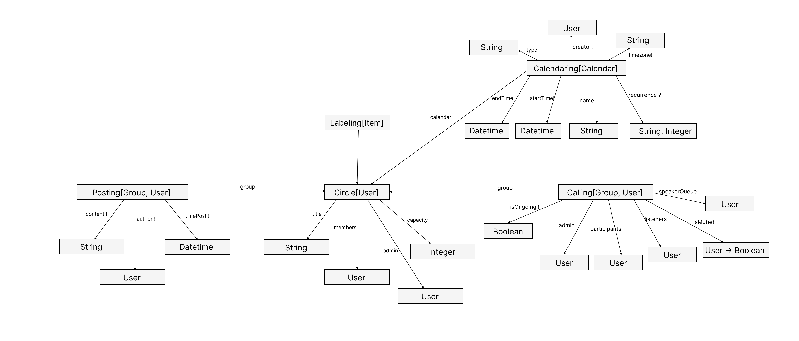

# Backend Design & Implementation - Beta

## Data Modeling

### Concepts

### Concept Diagram

## Concept Implementation
 See code links below:
 - [Posting Concept](https://github.com/arzyabl/backend/blob/main/server/concepts/posting.ts )
- [Calling Concept](https://github.com/arzyabl/backend/blob/main/server/concepts/calling.ts)
- [Circle Concept](https://github.com/arzyabl/backend/blob/main/server/concepts/circling.ts )
- [Calendaring Concept](https://github.com/arzyabl/backend/blob/main/server/concepts/calendaring.ts )

## RESTful routes
[See the code here](https://github.com/arzyabl/backend/blob/main/server/routes.ts)

## Deployment
I deployed my project in Vercel [here](https://backend-topaz-tau-30.vercel.app/).

## Design Reflection

- **Islamic Timings and Calendar Integration**: Initially, I had a separate Islamic Timings concept to handle prayer times and other religious events. However, I realized that it wasn’t user-facing or interactive enough to stand alone. Instead, I decided to integrate it with the Calendaring concept, making it more relevant to the audience. Moreover, I decided to replace the Gregorian calendar with the Hijri calendar, which is more aligned with the Muslim community’s preferences (coming soon).

- **Dynamic Prayer Times and No Local Store**: Another significant design decision was to remove the state variable for prayer times within the app. Instead of relying on static data or updating it daily, I chose to integrate the ‘adhan’ library, which fetches dynamic prayer times. This reduces complexity in maintaining the app and ensures accuracy for users. With this approach, I shifted the focus of the calendar from static time tracking to one that reflects real-time religious events and activities.

- **Removal of Notifications**: At first I got carried away by adding concepts, but remembering feedback from user interviews, I decided to remove the notification feature. Notifications were seen as distracting, especially during religious gatherings or focused learning sessions. Instead, I synced posts and calendaring to keep circle members informed about important events, such as calls or deadlines, without needing separate alerts. This simplification aligns with the feedback on reducing distractions.

- **Leaderboard**: To encourage engagement within the app, I introduced a leaderboard for posts within circles. Inspired by Duolingo’s friendly competition model, this feature motivates users to contribute more actively, fostering a sense of community. My plan is to expand it to other interactions such as calling engagement etc. This can ultimately serve for the badges system I talked about earlier in my divergent design stage!

- **Calling Engagement States**: The call feature was streamlined by consolidating all participants into a single array, encompassing both active participants and listeners. This eliminates the need for separate state tracking, enabling smoother transitions during calls and minimizing interruptions or confusion, which enhances the overall learning experience.

## Additional comments
I want to add tagging for Circles and Posts, but I ran out of time.
I also plan to change Gregorian calendar to Hijri (Islmaic Calendar that determines holidays).

## Credits
- ChatGPT - help with debugging / trouble shooting concept implementation, understanding given code, brainstorming, and condensing texts