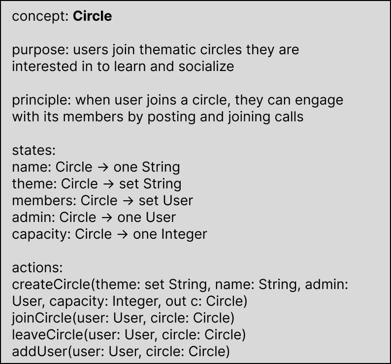
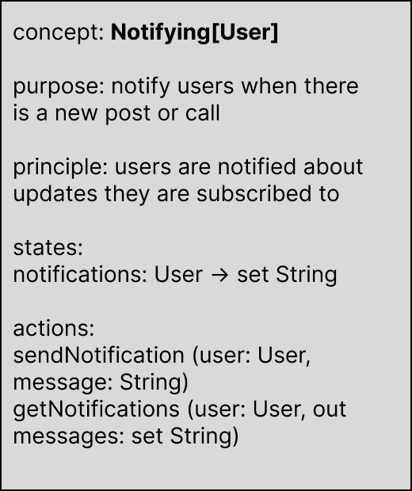
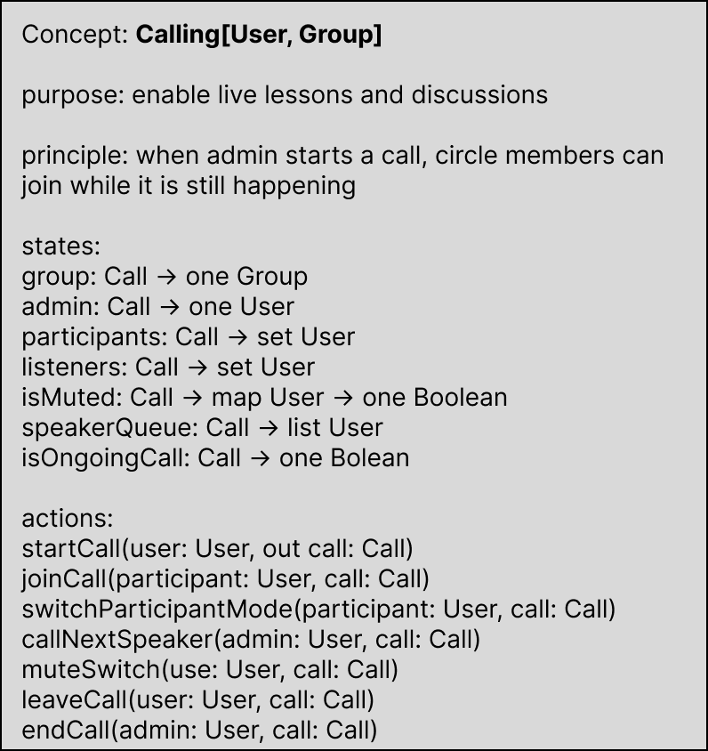
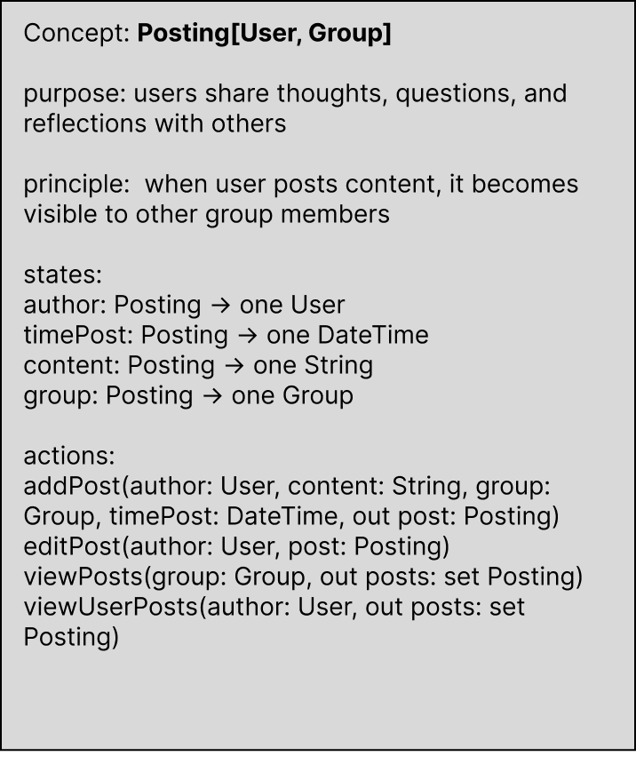
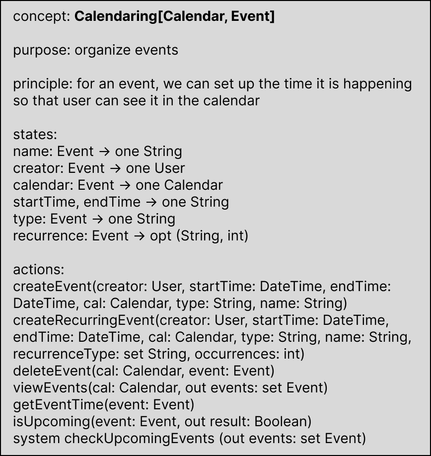
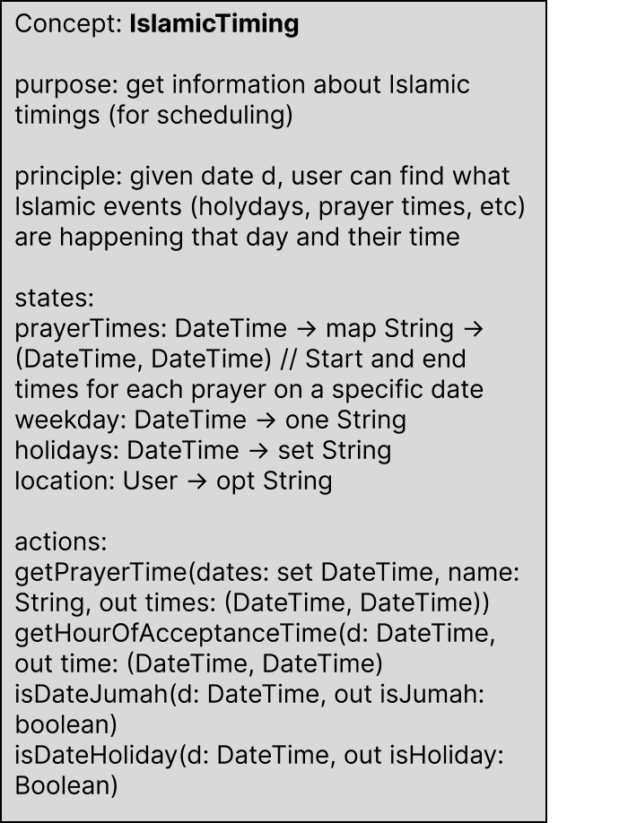
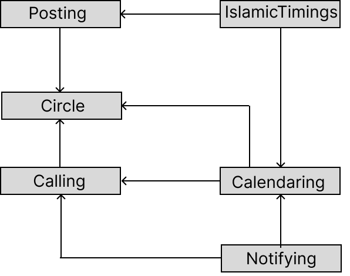

# Convergent Design

## Sisters Halaqa App Pitch
Introducing *Sisters Halaqa* — an empowering space designed exclusively for Muslim women looking to build a strong community of sisterhood through seeking beneficial knowledge. Whether you’re a stay-at-home mom or any woman committed to learning, Sisters Halaqa offers a safe and supportive environment for growth.

Our app features tight-knit circles, where users can join based on their preferences and engage in meaningful discussions. From posting reflections and sharing Islamic insights to joining live discussion calls led by qualified teachers, circle members engage in active learning and connection. With features designed to align with Islamic values, including scheduling calls around prayer times and privacy considerations, Sisters Halaqa makes it easy to prioritize both religion and socializing. 

More than just an app, Sisters Halaqa is a safe haven for Muslim women, offering a space to learn, connect, and thrive—all from the comfort of your home.


## App Concepts

<div style="overflow: hidden;">
  
  
  <br style="clear: both;">
  
  
  <br style="clear: both;">
  
  
  <br style="clear: both;">
</div>

## Synchronizations
```
app SistersHalaqa

	include Posting, IslamicTiming, Calling, Calendaring, Circle, Notifying

	synch postReminderAt(date: DateTime, timingName: String, author: User, 
                        content: String, circle: Circle):
	    let postAt, _ = IslamicTiming.getPrayerTimes(date, timingName)
	    Posting.addPost(author, content, circle, postAt)


	synch endCallWithSummary(call: Call, admin: User):
        Calling.end(admin, call)
        let content = f“Call {call.getName()} ended.” #add more specific info
        Posting.addPost(admin, content, Calling.getCircle(call), DateTime.now())
 

	synch scheduleRecurringEventAfterPrayer(creator: User, cal: Circle, prayerName: String, 
                                            dayOfWeek: String, timeAfterPrayer: int, duration: int, 
                                            recurrenceType: String,  occurrences: int):
		let currentDate = getCurrentDate()
		currentDate = adjustToNextWeekday(currentDate, dayOfWeek)
		for (occurence in range(occurrences)):
            let prayerTime, _ = IslamicTiming.getPrayerTime(currentDate, prayerName)
            let eventStartTime = prayerTime + timeAfterPrayer
            let eventEndTime = eventStartTime + duration
            Calendaring.createEvent(creator, eventStartTime, eventEndTime, cal, "Call", 
                                    "Weekly Event after " + prayerName + " Prayer") 
            if recurrenceType == "weekly"
                currentDate = currentDate + 604800 
            else if //add more recurrence options		
	
	system sync notifyForUpcomingCalls(user: User, event: Call):
		let upcomingCalls = Calendaring.getUpcomingEvents(user) #or for each user?
		for (event in upcomingCalls):
            let callTime = Calendaring.getEventTime(event) 
            Notifying.sendNotification(user, "Upcoming call at " + callTime)
	
		
```


## Dependency diagram

{:width="400"}


## Wireframes

[View my Figma flows here.](https://www.figma.com/design/vbzEO7jR57TANWgAtaN9E4/Untitled?node-id=4-5&t=pbDklZrqhn8kOXk9-1)

While these flows don't cover the entire app's functionality, they represent all key flows.


*Figma wireframes overview*

## Design trade-offs

1. **Free-to-join Circles with Capacity:** Initially, I considered an application process for circles to screen out unwanted members (e.g., males, scammers, or unmotivated participants). However, this added complexity for users and made it difficult to establish consistent admission criteria. To simplify the experience, circles will now be free to join, with descriptions and difficulty levels to guide users in selecting appropriate circles. Privacy is maintained since women won’t need to share personal information. Circle admins will manage membership, ensuring that participants align with the group's goals. Setting a capacity limit allows for better engagement and minimizes disruptions once lessons start.

2. **No In-call Chatting:** While chat features are common in video call apps, they can be distracting, especially for the interactive, focused lessons Sisters Halaqa is designed for. Instead of chat, users can close the call view to post in the circle’s section if needed. This allows participants to communicate with the teacher in emergencies or share reflections, while ensuring media shared during calls remains accessible after.

3. **No Profile Personalization:** Profile customization is common on social media, but it’s unnecessary for this app’s purpose. Sisters Halaqa focuses on knowledge-sharing and community-building, not on self-presentation or follower accumulation. This decision enhances privacy and aligns with the app’s ethos.

4. **Simplified Calendaring:** Rather than a complex event creation feature, the app will provide a visual representation of scheduled calls and religious observations. Users won’t create their own events, as the focus is on circle-based learning, not individual activity.

5. **No Geographic Information:** Although geographic-based circle filters were considered, I chose to embrace borderless communication. I remember the different perspectives I received regarding this issue when speaking with the interviewees. Circles descriptions can be suggestive of the leader’s time zone, but location will not be an explicit filter, encouraging diverse connections. Secure third-party integration will handle location-specific prayer times.

## Credits
- 6.1040 Office Hours (Naomi) - help understanding & identifying concepts
- ChatGPT - help formatting web page and condensing texts