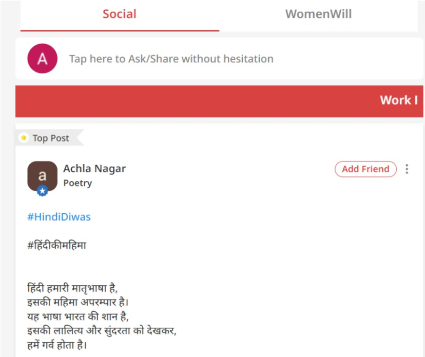
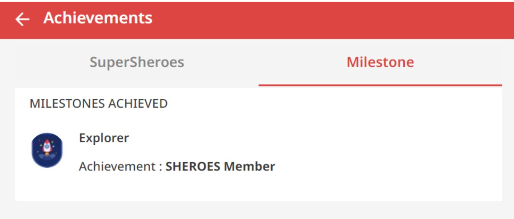
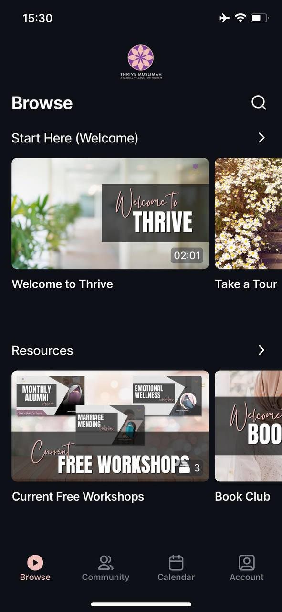
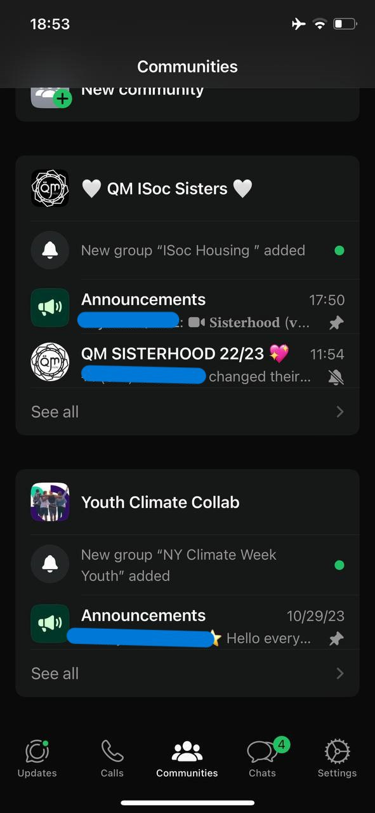
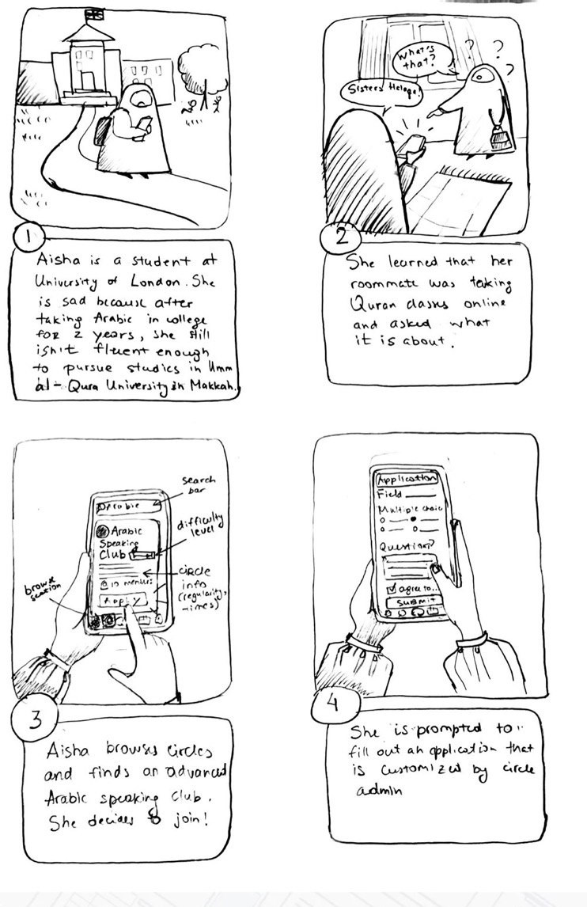
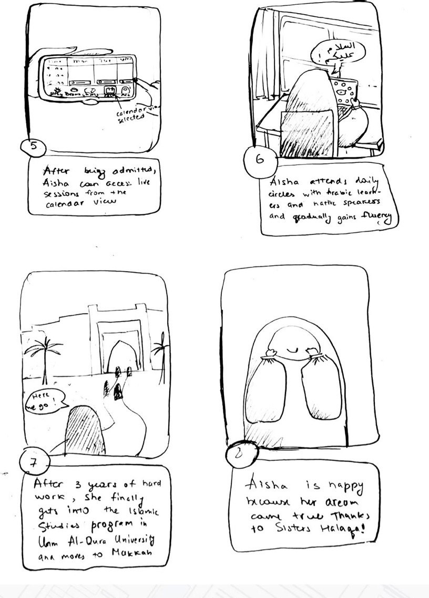
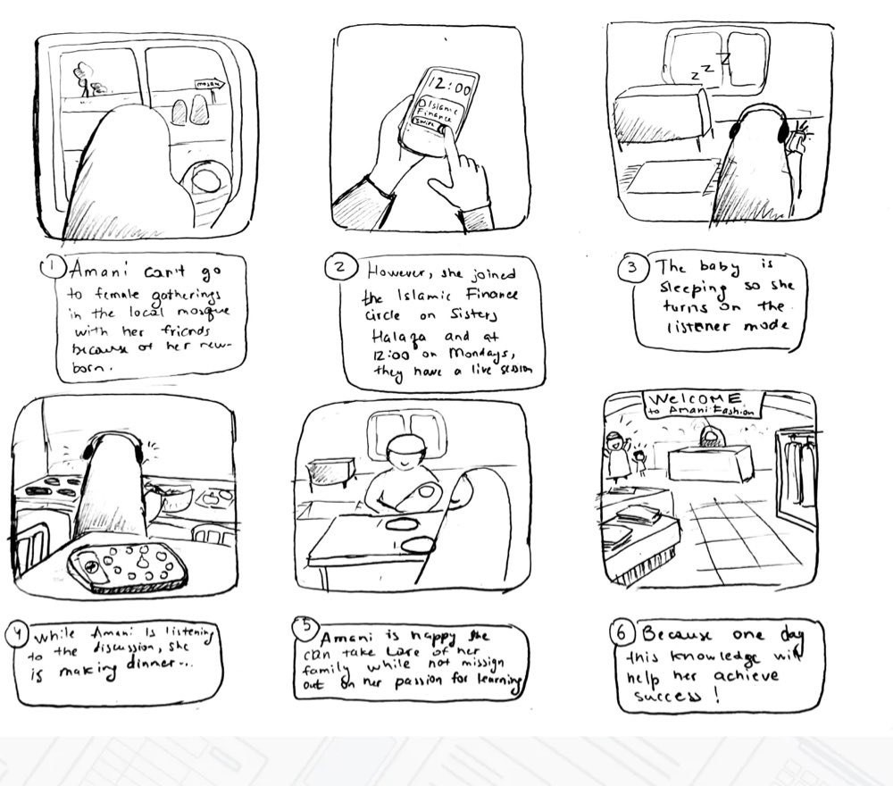
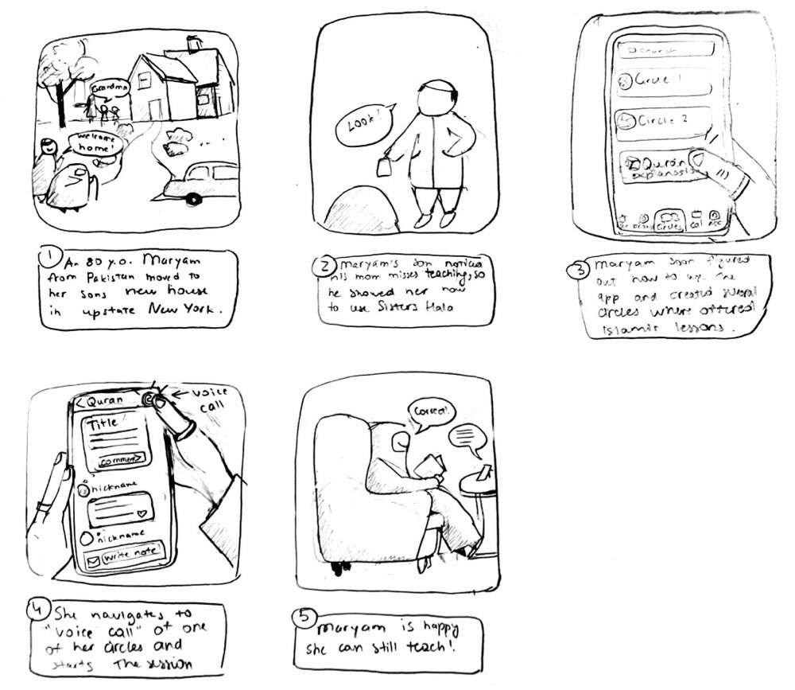

# Divergent Design

## Application goals

**Name:** Sisters Halaqa.

**Audience:** stay-at-home Muslim women.

**Value**: create a safe space for stay-at-home Muslim women to learn about Islam and build sisterhood.

## Scrapbook of comparables

### Sheroes
Women-only social network with communities, counselling helpline, opportunities, resources and conversations developed in India.

Unfortunately, the mobile version is not available in the U.S. but I was able to test the web version. 

As soon as you sign up and log in, they also ask for interests. Good idea, but bad execution. After selection, the user is signed up for communities on that category without approval.
{:width="400"}

There is a feed with posts from all your communities and people the user is following. I like the design; it is very recognizable, with top-performing posts on the top. However, scrolling this way can become a bit addictive, which does not align with the educational focus of Sisters Halaqa. So, I won’t be creating a feed with all posts and instead have posts sorted out into the communities/chats they belong to. 
{:width="400"}

I like the milestone feature (mine can have 'new', 'student of knowledge', 'scholar', etc.)
{:width="400"}

### Thrive Muslimah

 Thrive Muslimah positions itself as the first of its kind app in the world providing a support system for women that is line with Islam. The app also includes live lectures, courses, PDFs, and Ramadan Program. However, in order to get access to all this content, one needs to pay a monthly subscription.

 I like how the browse pages includes intro that describes the app’s missions and services. It is broken down into sections and easy to locate. There is also a search which is nice to narrow down the browse. Unfortunately, as a non paying user, I cannot see what the app looks like when logged as only subscribers can access that.
{:width="200"}

Another feature that I like is the calendar view that shows all lectures and events.
{:width="200"}

### Telegram & Whatsapp

One feature I’d really like to borrow from Telegram is the ability to sort chats into folders. On Telegram, though, you need to manually find this in settings, but for my app, I want to make it the default (sorted based on tags and can be edited manually).
{:width="300"}

I also like the new communities feature on Whatsapp. For example, an Arabic learning circle can have the main chat where lessons are held and assignments assigned but in addition to it a sub chat where memes or videos in Arabic are shared between members.
{:width="200"}

## Feature Ideas
After brainstorming with Arli Moyao-Ramirez and Adriana Castillo , I came up with following app features:
1. **Circles**: a chat group with multiple users that has a specific purpose and an admin. Users interact with each other using text notes or calls. A user can initiate a circle in which case they become admins. A user can join a circle by searching for it and applying. Admins choose if the user is accepted.
2. **Communities**: admins can create communities that contain several circles.
3. **Account Info**: for privacy purposes, account info visible to other users is limited to name, age range, region. No photo, but can select from several avatar options or use their Facemoji. This also limits prejudices users might have towards each other.
4. **Exploring circles/communities**: the user can explore different circles based on her preferences by filtering circle characteristics like size, region, etc, or choosing the category.
5. **Circle matching**: the user answers a series of questions and gets circle matches. Once here is an option to apply to the circle.
6. **Circle folders**: grouping circles into folders for ease of access and better organization.
7. **Favorites**: users can flag posts as favorite and this will be stored in a separate ‘chat’ unit. Users can also store images and other files there for easy access. Since the user is the ‘admin’ of her Favourites chat, she can also send timed posts as reminders.
8. **Circle notes**: Circle members can send notes - aka messages - to other members of the circle. The admin may choose to limit the number of those who have permission to post (for example, only admin, or admin and moderator etc), but any chat member can comment on or react to others’ notes. 
9. **Note formatting**: notes can have different text formatting options (heading, main, cursive, etc), stickers, files, etc. Formats can be accessed by selecting “format” while typing a note.
10. **Timing notes**: notes can be timed to be released and there is an option to set time to prayer times (after morning prayer etc) which is synched with local mosque. This is useful to send reminders to make certain supplications on specific days and make sure circle members get them according to their time zone.
11. **Video/voice call**: Initiated by circle admins for circle members to join. Users join as participants, but can also switch to listener mode if they are busy (watching children etc).
12. **No camera calls?**: Perhaps I should make it that circles can only have voice calls for better privacy. Connection is meant to be built on people’s personalities, not appearance. 
13. **Ustadha**: The admin selects the ustadha aka the teacher/leader of the session. On calls, ustadha can call on people, mute, present slides, switch between phone or video call.In chats, she can send quizzes and grade assignments.
14. **Talking circle**: Ustadha can turn on the feature to call participants in a circle order.
15. **Polls**: posted by admins to collect members' answers/opinions. Can be used by Ustadha as quizzes.
16. **Private grading**: For completing assignments, members get grades that are private from other members. The intention is to show progress. For the admins, they indicate if the member is doing okay or falling behind.
17. **Call reactions**: silent reactions include Islamic sayings like “MashaAllah”, “Alhamndulillah”, etc.
18. **Scheduling calls**: admins can schedule calls, make them reappearing, etc. Appears to users in their time zone.
19. **Calendar**: a section where the user can see all scheduled calls and their times.
20. **Notifications**: when a user is on the app, if a call is made from a specific circle, it only appears as a banner on top, does not interrupt the user from whatever she was doing. However, when not on the app, the call appears as a regular phone call. No notifications for messages unless the admin chooses to send them as important, in which case it appears as a banner. This is to minimize potential distractions.
21. **Badges & milestone**: based on the number of hours spent learning in the app or any credible third party certification, a user can get a different status.

## VSD Analysis
1. **Indirect Stakeholders**: Sisters Halaqa will indirectly affect in-person circle organizers and teachers by dragging some of the students away to online. However, the app is not meant to replace the in person lessons. Because of the app’s focus on text content and voice calls, in-person circles still have an advantage in irreplaceable face-to-face connections. Rather, the app caters towards women who do not have a community they identify with or access to such education resources. Still, many women who are attending such in person gatherings will most likely want to enhance rather than replace them. 
2. **Direct Stakeholders**: Furthermore, the in-person teachers might even turn into direct stakeholders by using the app for its other services (group chats, scheduling, reminders, tests, etc), while holding all live circles in person. Therefore, as a designer, I will need to make sure the app makes sense for that use as well. For example, being able to make private access or make it public only for local users (I like this idea better as it can increase exposure of the in person gatherings to those who happen to live nearby).
3. **Non-target Use**: I can think of many ways Sisters Halaqa can be used in unintended ways. One is using private for paid services which is not ideal for the app’s mission. However, now that I think about it, some teachers might ask for a symbolic fee that allows them financial independence when they can’t work outside home. As long as there is transparency for users who apply for a circle, that is okay. Payment is not something I will integrate, so Terms of Use must outline that the legal responsibility for declaring income etc is on the app users. To avoid fraud, there will be warning to users as well before joining such circles.
4. **Time – Sustained Friendships**: As a result of being in the same circle,some members might want to become friends, but they don’t have to. In a way, this is similar to how colleges work, where students come with the main purpose of learning and usually end up making friends, but not all do. Sisters Halaqa is not meant to nurture 1-on-1 friendships but rather create space for Muslim women to learn and socialize. Taking inspiration from colleges, although there won’t be any friends-specific features, the existing features don’t prevent friendships and even channel them to contribute to a larger community. For example, two or more members can create a separate chat to communicate with each other. Or, if two friends who knew each other outside Sisters Halaqa, they can join same circles. This said, a friendship born in Sisters Halaqa can move on to outside the app as college friends continue the relationship after graduation.
5. **Pervasiveness - Crossing National Boundaries**: the most obvious problem is that because Sisters Halaqa is centered around verbal communication (as opposed to highly visual apps like Instagram or TikTok), language barrier will be a problem when it comes to international circles. The technical solution to this would be offering the app in multiple languages with built-in translation for text notes and providing subtitles for calls. As for design, I can also include language as a category or filter for circles so that users only see circles that match their preferred language. This can also help expats or immigrants to connect to communities back home.

## Storyboarding
Aisha
{:width="300"}
{:width="300"}

_______________________

Amani
{:width="500"}

_______________________

Maryam
{:width="500"}