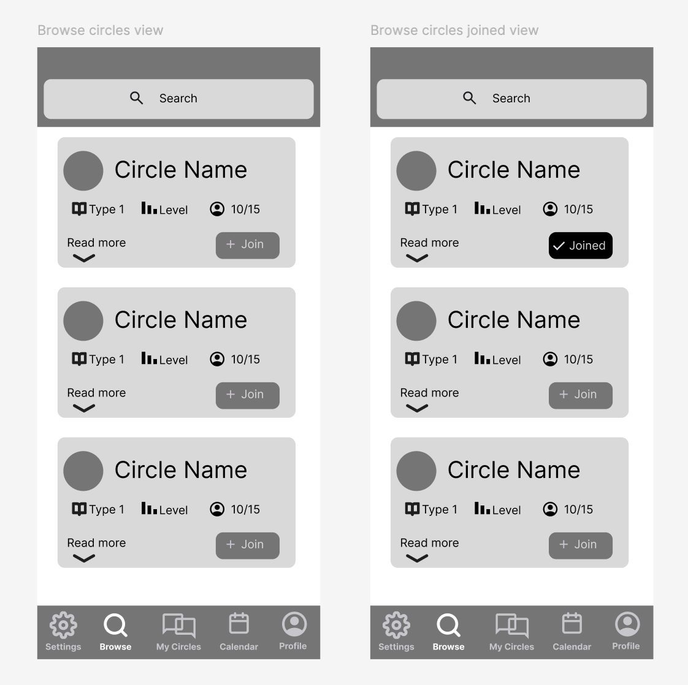
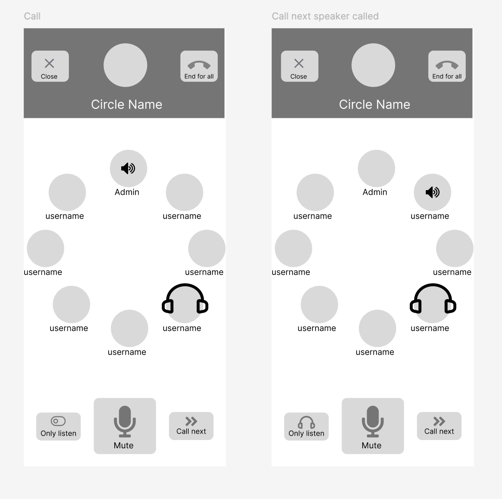
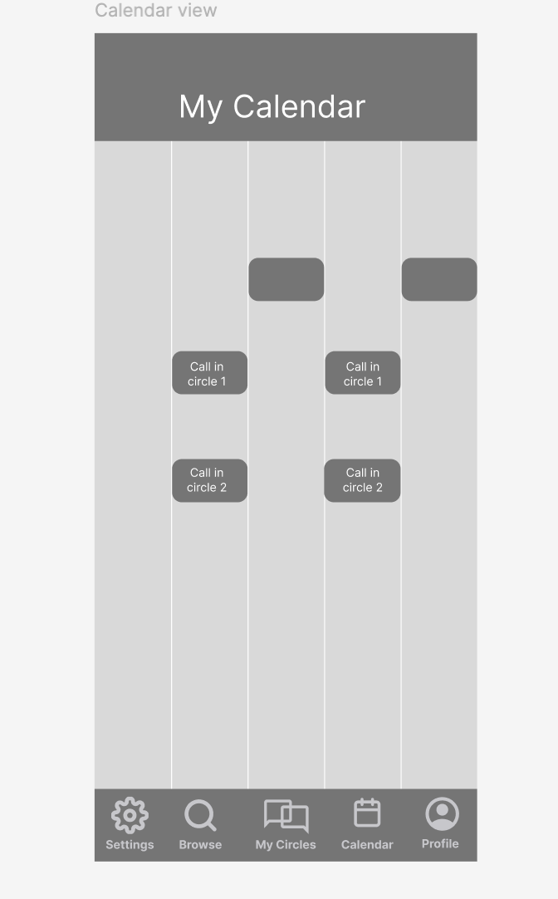
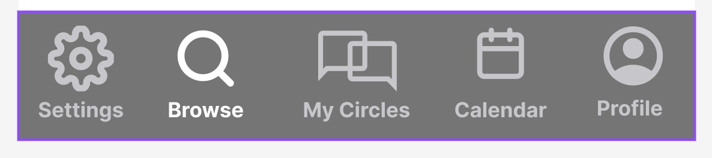
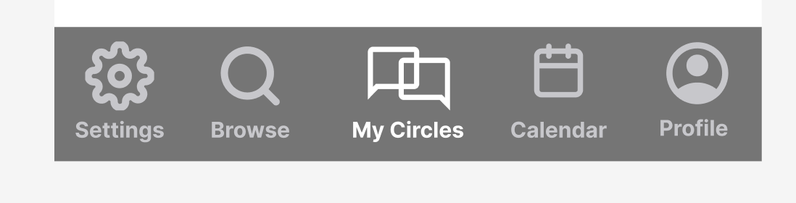
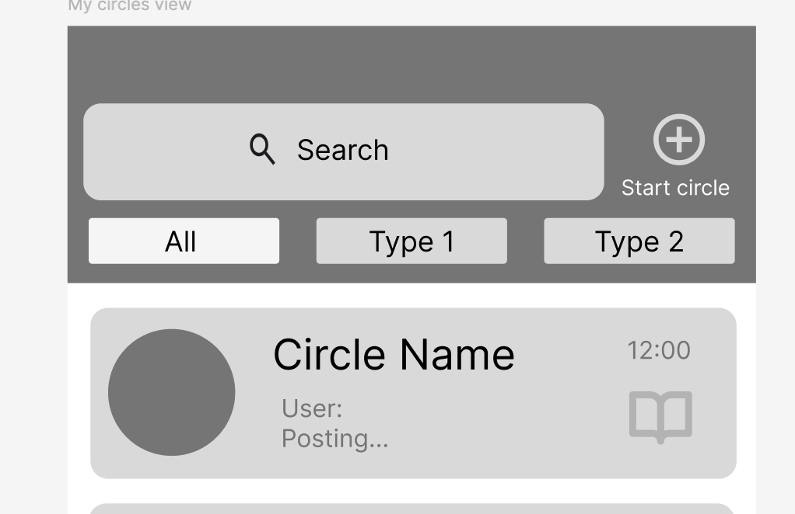
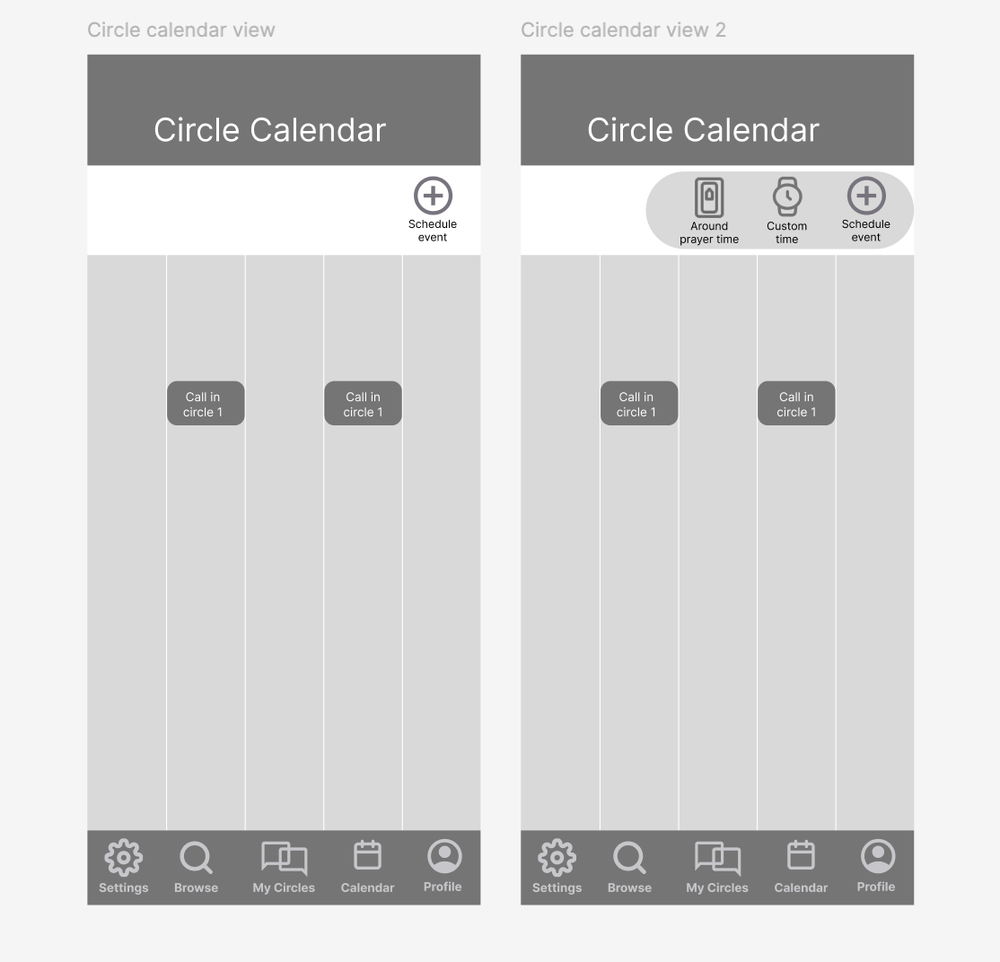
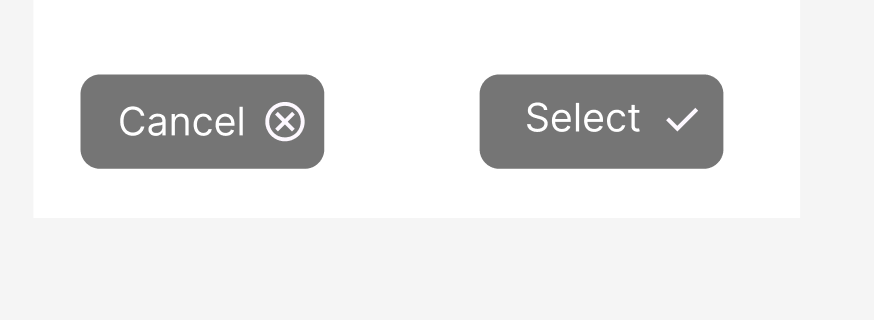
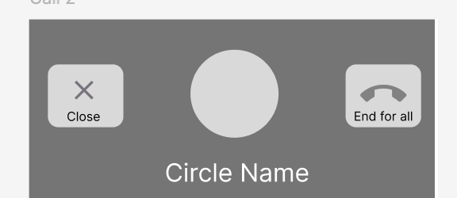

# Frontend Design - Alpha

## Heuristic Evaluation

### Usability Criteria
- **Discoverability**: 
I designed an interface that draws ideas from several apps with similar functionality. It effectively uses standard icons to help the user immediately understand functionality, making the process of adopting the app faster and smoother. For those completely new to social media or texting apps, as could be the case with older audiences, I minimized the surface of the app, especially for non-admins. It includes visual cues and text descriptions to avoid ambiguity. 

- **Safety**: 
My previous wireframe didn’t consider this at all. It was easy to make mistake in say, joining a circle by mistake by one click, undoing which can be done only from the circle view:
{:width="400"}
Additionally, my app violated this rule by not providing any confirmation messages when leaving the circle (user can lose the last spot), ending the call (automatically sends a post with a summary and if call restarts, the speaker queue will be lost), and deleting posts without being able to recover. Therefore, in the next iteration,  I will add necessary confirmations and keep these actions at least 2 clicks away.

### Physical heuristics
- **Gestalt principles**: My call view is a good example where this rule shines. I use a circle layout to indicate that there is a queue where people take turns in a sequence to speak, controlled by the admin. Also, call actions items are grouped by their function: the ones above allow users to switch out from the view with or without ending the call, while the ones at the buttom switch between participation states in the call.
{:width="400"}
In calendar view, events are laid out in chronological order, and their location between each other indicated at their relationship. I will also use color to show same recurring events or events of same type.
{:width="200"}

- **Situational context**: While not explicitly thinking about this criteria, I uncoinsiously incroporated it in my design. I created a nav bar that helps switch between pages while conveying context. I color the current page in white while the rest are dimmed. For example, here I switch from Browse to My Circles view:

{:width="400"}

{:width="400"}

In circles view, i have the option to see circles of a specific label/category, and the one that is currently selected is highlighted while the rest are dimmed: 
{:width="400"}

- **Accelerators**:
Intead of looking up prayer times, there is an option to quickly set event time according to prayer times. It significantly accelerates the time needed for setting up events, especially recurring ones, while avoiding conflicts with prayer times that fluctuate daily.
{:width="400"}

### Linguistic level
- **Consistency**: 
OK is always on the right while cancel or go back is always on the left:

{:width="400"} 
*Fragment from Create Event View*

{:width="400"} 
*Fragment from Calling View*

- **Information scent**:
I haven’t really accounted for this in the wireframes, but on Browse view search bar, I will add the option to autocomplete or pick from drop down of existing circle categories/tags/levels.