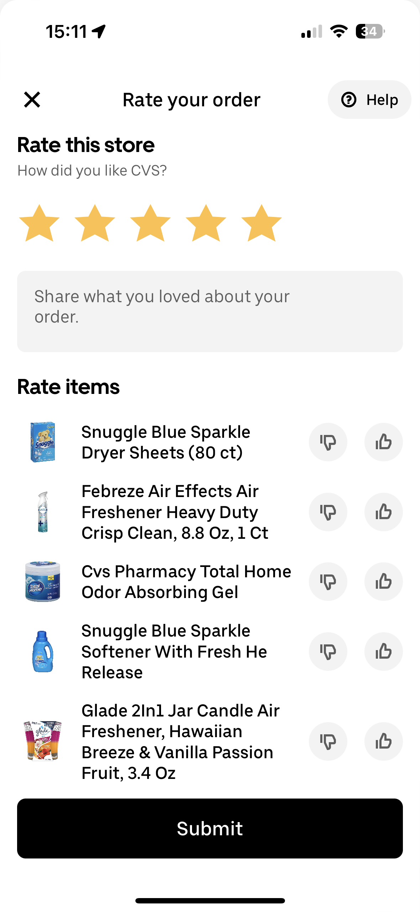
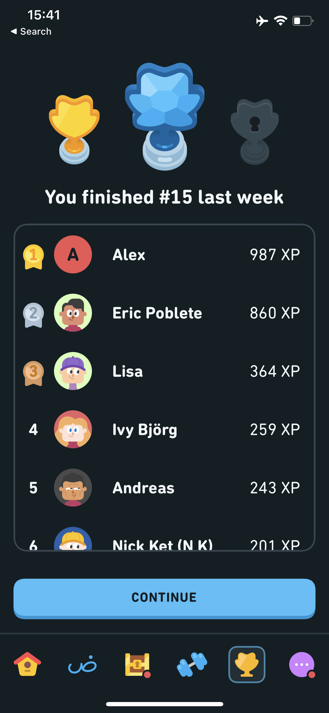

# Project Phase 2: Divergent Design
November 11, 2024. By Carla, Adriana, Arzy, Arli

## Broad Application Goals
Our app, **RePlate**, is designed to **empower sustainability-minded individuals** and **those experiencing food insecurity** by directly connecting people with surplus food to those in need. Unlike similar platforms, our app eliminates third-party involvement, allowing users to engage in **direct exchanges**. We believe this approach will nurture a **culture of food-sharing**, build stronger community ties, and inspire people to support one another in meaningful, lasting ways.

## Scrapbook of comparables

### Too Good To Go
This design shows the user the amount of money they saved and the amount of Co2 emissions they saved by purchasing foods that are left over at the end of the day that prevented even more food waste. This could be useful to provide users with a informational perspective of how their actions make a difference, serves as an incentive. 
{:width='400'}

### Uber Eats
Very pleasing and convinient filtering - no need to type, what you are looking for is one click away, more options for a more selective search
{:width='400'}

Time estimation - very useful for busy people who are debating between ordering a single ingredient from a grocery store or asking neighbors
{:width='400'}

Reviewing system is direct and to the point. Important and could be used similarly for users to review the items when they receive them to ensure both its quality and safety. 
{:width='200'}

### Instacart
Shows the product information as a drop down under details and provides a slide of the nutrional facts that display the ingredients - useful as a potential way to display information if users plan to exchange prepared foods
{:width='400'}

### Depop

By clicking on a user, others can see how long the seller takes to ship - maybe we can have similar stats with the response time?
{:width='400'}

Profile page also allows see posts of one specific user. Tt makes it easier to buy from one seller and one can save on shipping. In the context of our app, if the user is looking for several items, it would be easier to make one trip to one person than get the items from different places.
{:width='200'}

Instructions on how to make photos and examples will be super helpful for users to make their postings more appealing.
{:width='200'}

### Facebook Marketplace

Map view is nicely implemented: users can customize the local radius and only listings within that distance will be displayed
{:width='200'}

### Olio

A similar feature is present in Olio, but it also groups items by location
{:width='200'}

Communities are a good way to nurture long-term friendships, but it should not be predefined like in Olio where users can't create new ones and must apply to join existing communities.
{:width='200'}

### eBay
Saved searches allow users to mark postings they want to come back to, and we can also use it to find out when foods the user regularly claims are being posted.
{:width='400'}

### Duolingo
Leaderboard is a way to to highlight user achievement and encourage them to keep going. We can implement a similar concept in the shape of badges or something like that.
{:width='200'}
