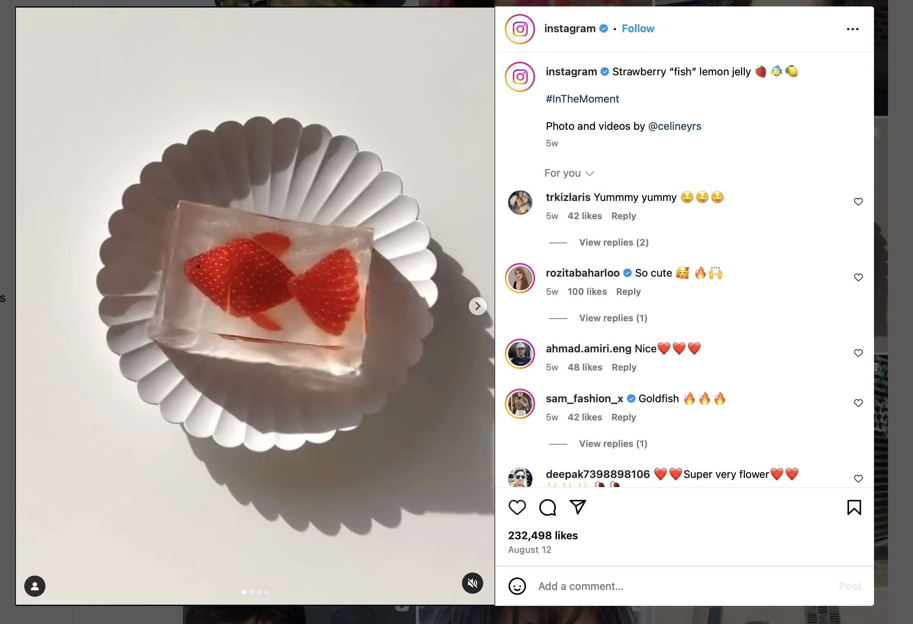
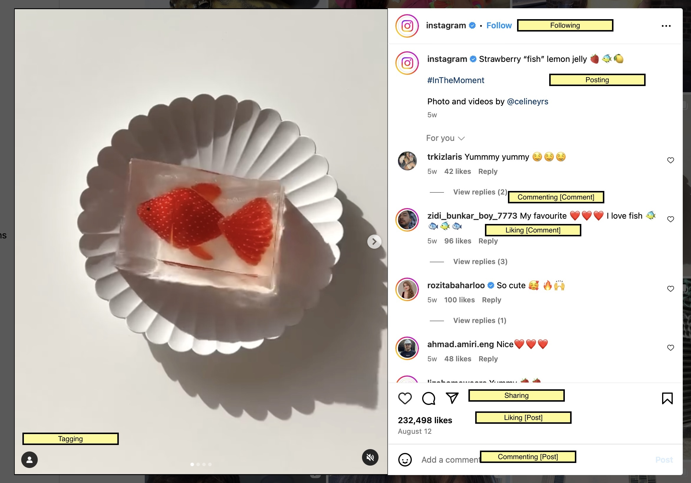
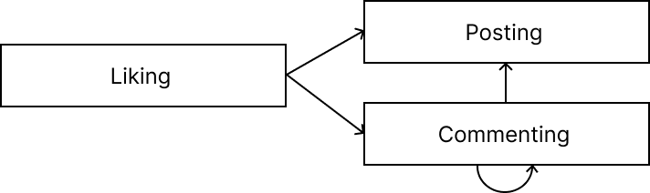

# Blog 1

### Reflections on Lecture 4 & 5: Towards Concepts and Concept Basics

Let’s apply what we learned about concepts in class on a different app, say Instagram. Instagram is built around people posting and interacting with each other’s posts. This functionality is made possible with several concepts. 

Consider this page:
{:width="500"}

We can identify some main concepts:
{:width="500"}

I want to discuss how concept-driven design could have influenced Instagram UX.

### concept Liking
In earlier versions of Instagram, users could like only posts. When the feature of liking comments rolled out, it became immediately clear how the feature works because of the mental connection with liking posts – they indicate how many users liked the thing! 

So, in this case, keeping Liking[item] as a separate concept allowed it to be reused for comments as well as posts, and choosing similar UX (heart shape, like count) created the mental connection for users. Here, the software and UX align perfectly. 

### concept Commenting
Early versions of the app had comments on posts, but no reply threads. Replies were done by tagging the person to whom you want to reply. This created a lot of confusion for many users, and it was hard to follow who replied to who and when. 

However, when developers attached replies to comments – the problem was solved! Essentially, replies became comments on comments. Although the names “reply” and “comment” are different, their UX (count, drow down) creates a mental connection between the two features. In this case, Commenting[item] is a concept that is applied to Posting and Commenting.

### Relational diagram
We can draw a diagram representing extrinsic dependencies between concepts:

{:width="400"}

## Conclusion
After doing this excecise, I feel more confident about the material I learned in class. By attempting to analyze an existing application, I was able to identify different concepts and the relationship between them.

